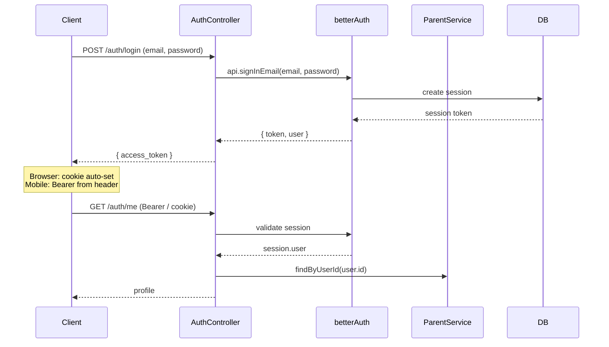
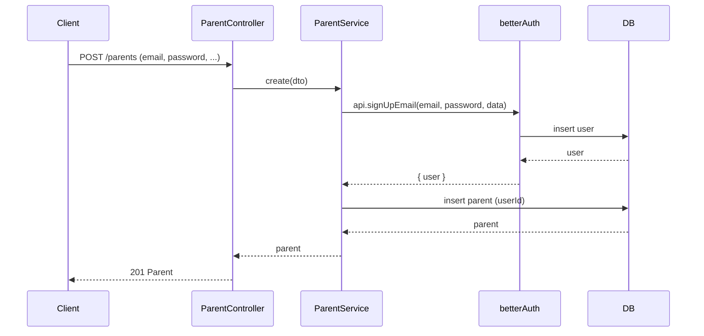
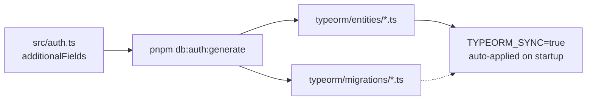

# Authentication — Better Auth

## Overview

This project uses [Better Auth](https://www.better-auth.com) via the NestJS wrapper
[`@thallesp/nestjs-better-auth`](https://github.com/thallesp/nestjs-better-auth)
with a PostgreSQL + TypeORM adapter
([`@hedystia/better-auth-typeorm`](https://github.com/hedystia/better-auth-typeorm)).

The auth instance is defined in `src/auth.ts` and injected globally into every
request. A global guard protects all routes by default; endpoints that should be
public are annotated with `@AllowAnonymous()`.

---

## Authentication Flow

### Login



Response: `200 { "access_token": "<session-token>" }`. The token is a Better Auth
session token, not a raw JWT (JWT cookie cache is only for cookie serialization).

| Client           | Token delivery                                                                                       |
| ---------------- | ---------------------------------------------------------------------------------------------------- |
| **Web browser**  | Better Auth sets an `auth-session` cookie automatically (JWT-cookie-cache).                          |
| **Mobile / SPA** | Extract from the `set-auth-token` response header on login. Send as `Authorization: Bearer <token>`. |

### Registration

#### Parent (public)



1. `ParentService.create()` calls `auth.api.signUpEmail()` — creates a Better Auth `User` and `Session`.
2. A `Parent` record is created with `userId` set to the new `User.id`.

The password is hashed and managed entirely by Better Auth. The `Parent` table
no longer stores a meaningful `password_hash`.

> **Username** — The Better Auth `username` field is auto-generated from the
> email's local part + a 6-char random hex suffix (e.g., `khalil_a1b2c3`).
> The `CreateParentDto.username` field is used for display purposes only
> (mapped to the `name` parameter in `signUpEmail`), not for the Better Auth
> `username` field.
>
> **Admin** — `CreateAdminDto` has no `username` field. It's generated
> automatically from the email at creation time via the same mechanism.

#### Admin (protected)

```
POST /api/v1/admins   ←  requires global guard (any authenticated session)
{ "email": "...", "password": "...", "first_name": "...", "last_name": "..." }

→ 201 Admin
```

Same flow as parent, but only an already-authenticated user can create an admin.

### Request Protection

The global guard from `@thallesp/nestjs-better-auth` rejects every unauthenticated
request unless the route carries `@AllowAnonymous()`. Currently only two endpoints
are public: `POST /auth/login` and `POST /parents`. All other routes require a
valid session.

### Session Lookup

Every protected endpoint can access the session via the `@Session()` decorator:

```ts
@Get('me')
getProfile(@Session() session: UserSession<typeof auth>) {
  return this.parentService.findByUserId(session.user.id);
}
```

Application entities (`Parent`, `Admin`) are never looked up by email any more.
The `userId` column (unique FK → `user.id`) is always used.

---

## Entity Schema

Better Auth manages four tables; the application adds two more.

### Better Auth tables

All live under `typeorm/entities/`. **Do not edit these files by hand** — see
the workflow below.

| Table          | Purpose                             | Custom fields                                                                                      |
| -------------- | ----------------------------------- | -------------------------------------------------------------------------------------------------- |
| `user`         | Core user record                    | `username`, `first_name`, `last_name`, `phone_number`, `lock_alerts`, `limit_warning`, `is_active` |
| `session`      | Active sessions                     | —                                                                                                  |
| `account`      | Credentials / OAuth accounts        | —                                                                                                  |
| `verification` | Email verification / password reset | —                                                                                                  |

### Application entities

| Entity   | Table    | File                                  | Link to User                  |
| -------- | -------- | ------------------------------------- | ----------------------------- |
| `Parent` | `parent` | `src/modules/parent/parent.entity.ts` | `userId` → `user.id` (unique) |
| `Admin`  | `admins` | `src/modules/admin/admin.entity.ts`   | `userId` → `user.id` (unique) |

### Custom user fields

Every field listed in `additionalFields` in `src/auth.ts` must also be declared
as a `@Column()` in the generated `typeorm/entities/User.ts`. **This is a
dual-declaration requirement**: Better Auth reads the field list at runtime,
while TypeORM reads the entity decorator to generate the DDL.

| Field           | Type    | Input | Required | Default | Auto-generated |
| --------------- | ------- | ----- | -------- | ------- | -------------- |
| `username`      | string  | yes   | yes      | —       | yes\*          |
| `first_name`    | string  | yes   | yes      | —       | no             |
| `last_name`     | string  | yes   | yes      | —       | no             |
| `phone_number`  | string  | yes   | no       | —       | no             |
| `lock_alerts`   | boolean | no    | no       | `false` | no             |
| `limit_warning` | boolean | no    | no       | `false` | no             |
| `is_active`     | boolean | no    | no       | `true`  | no             |

Fields with `input: false` are set server-side, never accepted from client
payloads.

\* `username` is auto-generated by `src/utils/username.ts`. The DTO should not
include a `username` field — it's derived from the email at sign-up.

---

## Generate Process

### How it works



The single source of truth for custom user fields is `additionalFields` in
`src/auth.ts`. The `pnpm db:auth:generate` script (once added to `package.json`)
reads that config and regenerates entity and migration files under `typeorm/`.

**You never edit `typeorm/entities/*.ts` or `typeorm/migrations/*.ts` by hand.**
Any manual changes there are lost the next time the command runs. The workflow is
always: edit `additionalFields` → run `pnpm db:auth:generate`.

The project uses `TYPEORM_SYNC=true` which tells TypeORM to sync entity
definitions to the database on every startup. After running generate, a
server restart is all that's needed to apply schema changes.

### Workflow: Add a new custom user field

1. Add the field to `additionalFields` in `src/auth.ts`.
2. Run `pnpm db:auth:generate`.
3. Restart the server — TypeORM auto-applies the change.

### Workflow: Add an OAuth provider (e.g. Google)

1. Follow the [Better Auth OAuth docs](https://www.better-auth.com/docs/authentication/oauth)
   to add the provider config in `src/auth.ts`.
2. Run `pnpm db:auth:generate` to refresh entity files if needed.
3. Restart.

---

## Maintenance

### Super Admin seeding

On every startup, `main.ts` calls `AdminService.ensureSuperAdminExists()`.
If no `SUPER_ADMIN` exists, it reads these environment variables:

| Variable                 | Example             |
| ------------------------ | ------------------- |
| `SUPER_ADMIN_EMAIL`      | `admin@example.com` |
| `SUPER_ADMIN_PASSWORD`   | `password123`       |
| `SUPER_ADMIN_FIRST_NAME` | `Super`             |
| `SUPER_ADMIN_LAST_NAME`  | `Admin`             |

It creates a Better Auth user via `auth.api.signUpEmail()` then inserts the
`Admin` record with role `super_admin` and status `active`.

### Testing with ESM mocks

Better Auth and its peer packages (`@hedystia/better-auth-typeorm`,
`@thallesp/nestjs-better-auth`) are **ESM-only**, which Jest cannot load
natively. The Jest config in `package.json` uses `moduleNameMapper` to redirect
them to a mock:

```json
"moduleNameMapper": {
  "^@thallesp/nestjs-better-auth$": "<rootDir>/../test/mocks/better-auth-mock",
  "^better-auth$": "<rootDir>/../test/mocks/better-auth-mock",
  "^better-auth/(.*)$": "<rootDir>/../test/mocks/better-auth-mock",
  "^@hedystia/better-auth-typeorm$": "<rootDir>/../test/mocks/better-auth-mock"
}
```

The mock lives at `test/mocks/better-auth-mock.ts`. It exports stubs for
`betterAuth`, `typeormAdapter`, `bearer`, `AuthService`, `Session`,
`AllowAnonymous`, and `UserSession`.

### Common pitfalls

| Pitfall                                          | Explanation                                                                                                                                                                                                                                                  |
| ------------------------------------------------ | ------------------------------------------------------------------------------------------------------------------------------------------------------------------------------------------------------------------------------------------------------------ |
| **Dual declaration**                             | A custom field must be declared in `additionalFields` (runtime config in `src/auth.ts`) AND it gets a `@Column` in the generated entity. The `pnpm db:auth:generate` command handles the entity side — just add to `additionalFields` and re-run generate.   |
| **password_hash conflict**                       | The `Parent` and `Admin` entities still have a `password_hash` column for backward compatibility, but Better Auth manages passwords. New records pass `password_hash: undefined` to prevent conflict.                                                        |
| **Nullable vs required mismatch**                | If a field is `required: true` in `additionalFields` but `nullable: true` in the entity, the DB allows NULL while Better Auth rejects it — confusing. The generated entity matches `additionalFields`, so this only happens if you edit it by hand (don't).  |
| **synchronize in production**                    | The project uses `TYPEORM_SYNC=true` in dev and Docker. This is convenient but risky in production — TypeORM can drop columns or data if an entity definition changes. For production-grade deployments, consider running proper TypeORM migrations instead. |
| **pnpm db:auth:generate recreates all entities** | Running this command overwrites all files in `typeorm/entities/`. Any manual edits there are lost. Edit `additionalFields` in `src/auth.ts` instead.                                                                                                         |
